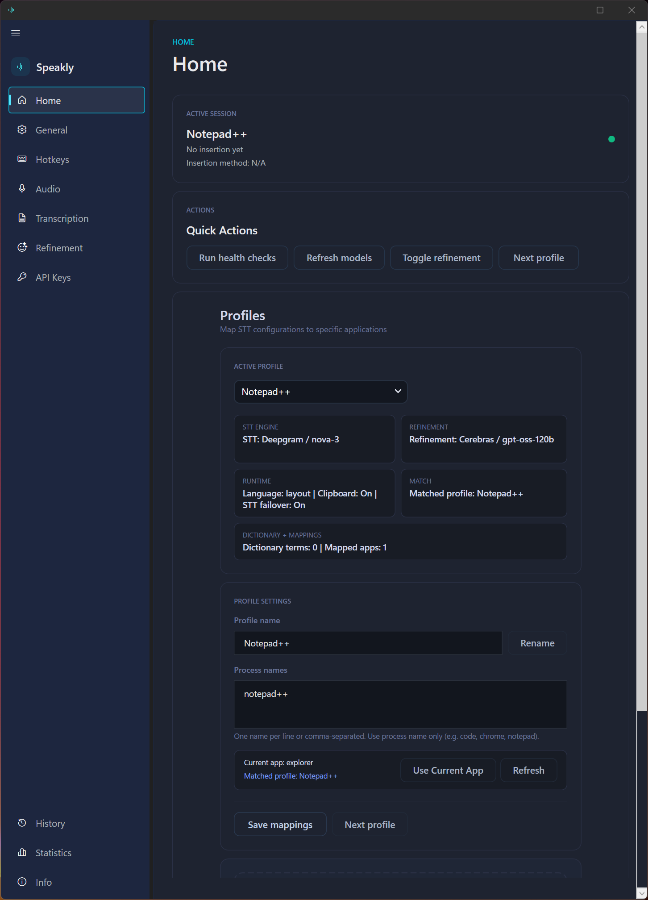
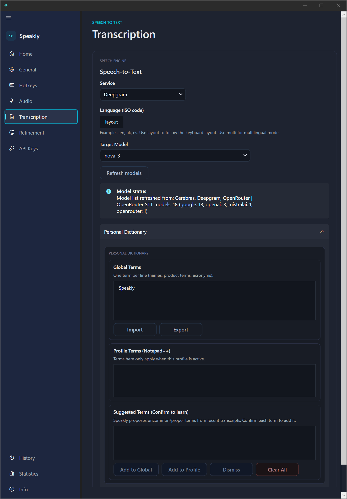
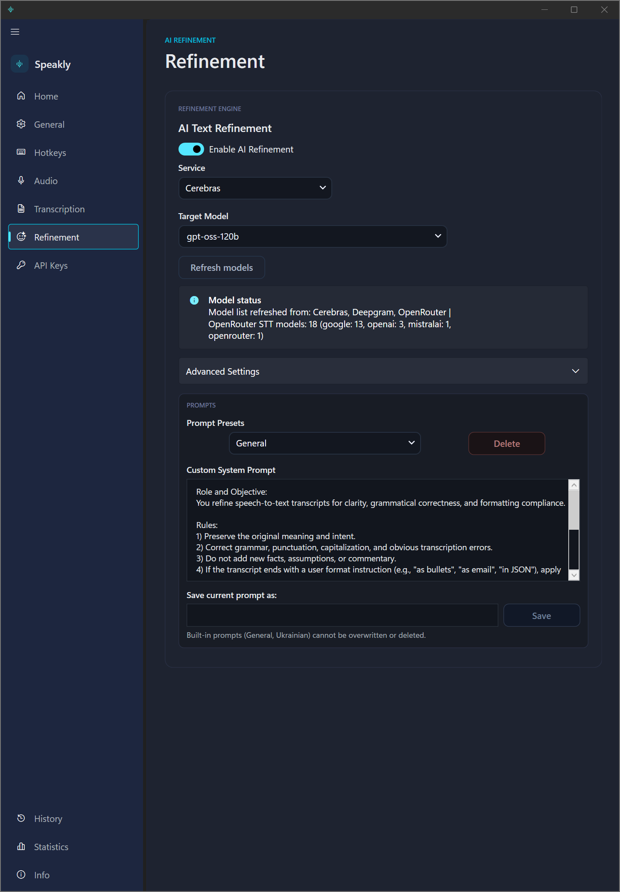
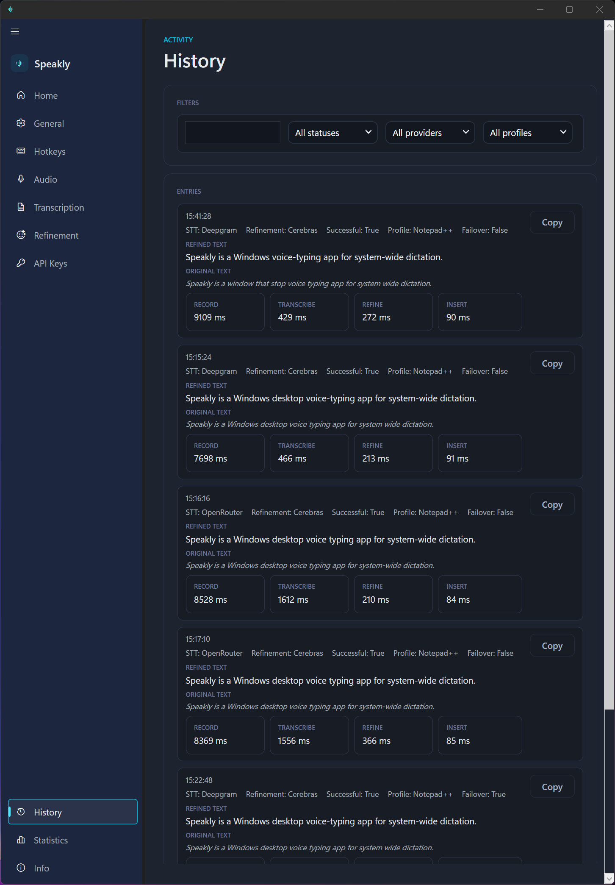
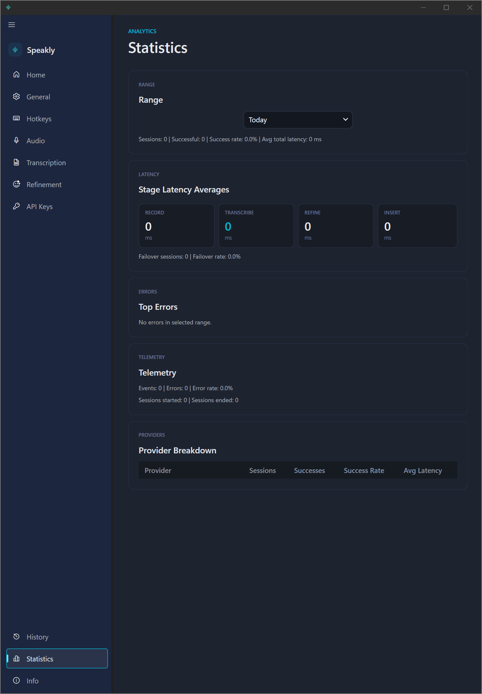

# Speakly

<div align="center">
  

  <h3>Fast Windows voice typing with optional AI refinement</h3>

  <p>
    Keyboard-first dictation for Windows with global hotkeys, profile-aware workflows, live provider switching, and reliable text insertion into the app you are already using.
  </p>

  <p>
    <a href="https://github.com/snook89/Speakly/releases"></a>
    <a href="https://github.com/snook89/Speakly/actions/workflows/ci.yml"></a>
    
    
    <a href="LICENSE"></a>
  </p>

  <p>
    <a href="https://github.com/snook89/Speakly/releases">Download</a>
    ·
    <a href="#visual-preview">Preview</a>
    ·
    <a href="#why-speakly">Why Speakly</a>
    ·
    <a href="#feature-overview">Features</a>
    ·
    <a href="#install">Install</a>
    ·
    <a href="#release-flow">Release Flow</a>
  </p>
</div>

<div align="center">
  
</div>

> Press. Speak. Insert. Speakly is built for fast system-wide voice typing, not just dictation inside a single editor.

## Visual Preview

<table>
  <tr>
    <td width="100%" align="center" valign="top">
      
      <br />
      <sub>Home screen with active session status, quick actions, and profile-aware workflow controls.</sub>
    </td>
  </tr>
</table>

<table>
  <tr>
    <td width="50%" align="center" valign="top">
      
      <br />
      <sub>Speech-to-text provider, language, model, and dictionary controls.</sub>
    </td>
    <td width="50%" align="center" valign="top">
      
      <br />
      <sub>AI refinement settings with prompt presets and model selection.</sub>
    </td>
  </tr>
</table>

<table>
  <tr>
    <td width="50%" align="center" valign="top">
      
      <br />
      <sub>History view with provider metadata, original vs refined text, and timing breakdowns.</sub>
    </td>
    <td width="50%" align="center" valign="top">
      
      <br />
      <sub>Statistics view with latency, provider performance, errors, and telemetry summaries.</sub>
    </td>
  </tr>
</table>

<table>
  <tr>
    <td width="50%" align="center" valign="top">
      
      <br />
      <sub>Floating overlay for status, quick actions, and at-a-glance feedback while dictating.</sub>
    </td>
    <td width="50%" align="center" valign="top">
      
      <br />
      <sub>Alternate overlay presentation with theme variations for different desktop setups.</sub>
    </td>
  </tr>
</table>

<sub>More screenshots are available in <code>Resources/README</code> and can be added to this gallery as the release presentation is finalized.</sub>

## Why Speakly

Speakly is for people who want voice input to feel like part of a serious desktop workflow instead of a disconnected assistant window.

- Global push-to-talk and toggle-record hotkeys.
- System-wide text insertion into the active window.
- Multiple STT providers with automatic failover on transient errors.
- Optional AI refinement with saved prompt presets.
- Per-app profiles that auto-switch by foreground process name.
- Floating overlay plus tray controls for fast recovery and status.
- Managed audio processing for cleaner captures.
- Local telemetry, history, and statistics for troubleshooting.
- Auto-update flow backed by GitHub Releases.
- Standard user runtime with on-demand elevation only when needed.

## At A Glance

| Keyboard-first | Provider-flexible | Reliability-focused |
|---|---|---|
| Use global hotkeys from anywhere in Windows and keep your hands near the keyboard. | Mix and match Deepgram, OpenAI, OpenRouter, and Cerebras depending on cost, speed, or quality. | Single-instance behavior, provider failover, debug logs, health checks, telemetry, and update support are built in. |

## Built For

- Writing in editors, docs, chat apps, terminals, and browsers.
- Switching between apps without reconfiguring your dictation workflow every time.
- Users who want optional AI cleanup without losing direct control over prompts and providers.
- Troubleshooting real-world voice typing problems with logs, history, statistics, and provider-level feedback.

## Feature Overview

| Area | What Speakly does |
|------|-------------------|
| Capture | Global hold-to-talk and toggle recording, microphone selection, sample rate and channel controls |
| Insertion | Inserts text into the focused app with `SendInput`, with clipboard-based fallback for reliability |
| Providers | STT: Deepgram, OpenAI, OpenRouter. Refinement: OpenAI, OpenRouter, Cerebras |
| Profiles | Create profiles for apps like Chrome, VS Code, Notepad, or Slack and switch automatically by process name |
| Refinement | Optional post-processing with custom prompts, built-in presets, saved prompt library, and model favorites |
| Dictionary | Global and per-profile personal dictionary, import/export, and suggested-term confirmation queue |
| Overlay | Always-on-top overlay with status, language badge, waveform, quick actions, and auto-hide |
| Tray | Tray menu for settings, profile switching, overlay recovery, refinement toggle, and exit |
| Reliability | Single-instance activation, STT failover, startup health checks, deferred auto-paste, debug logs |
| Observability | History, latency statistics, provider breakdowns, top errors, and local structured telemetry with redaction |
| Startup | Optional Windows startup registration through Task Scheduler, with minimized tray launch support |
| Updates | Checks GitHub Releases on startup, downloads updates, and prompts for restart when ready |

## What Is New In The Current App

This README reflects the newer feature set already present in the codebase:

- Redesigned Home screen with profile summaries and quick actions.
- Process-aware profiles with profile cycling, process capture, and match status.
- Prompt presets with save/delete flow for refinement prompts.
- Dynamic model refresh from provider APIs, plus favorite model pinning.
- Personal dictionary suggestions that can be confirmed globally or per profile.
- Managed audio processing with auto mic gain, normalization, and optional noise gate.
- Deferred target auto-paste when focus returns to the target app.
- Local telemetry controls for level, retention, file size, and redaction mode.
- Statistics page with latency, provider breakdown, error summary, and telemetry rollups.
- Windows autostart support that can start minimized to tray.
- More resilient Cerebras refinement tuning and STT failover behavior.

## Workflow

1. Press and hold the push-to-talk hotkey, or use the toggle-record hotkey.
2. Speakly captures microphone audio from the selected input device.
3. Audio is sent to the active speech-to-text provider.
4. If refinement is enabled, the transcript is sent to the configured AI provider.
5. The final text is inserted into the active app.
6. If direct insertion fails or the target app loses focus, Speakly can fall back to clipboard and deferred paste behavior.

## App Pages

| Page | Purpose |
|------|---------|
| Home | Active session summary, quick actions, profile switching, process mapping, and profile management |
| Hotkeys | Configure hold-to-talk and toggle-record shortcuts |
| Audio | Select input device and tune audio capture and processing |
| Transcription | Choose STT provider, language, model, dictionary, and advanced provider settings |
| Refinement | Enable or disable refinement, choose provider/model, manage prompts, and tune Cerebras requests |
| API Keys | Store and test API keys for Deepgram, OpenAI, OpenRouter, and Cerebras |
| General | Overlay, tray behavior, Windows startup, deferred paste, failover, logs, and telemetry controls |
| History | Review recent transcription activity |
| Statistics | Inspect latency, errors, provider success rates, and telemetry summaries |
| Info | Check version, update status, releases, and GitHub links |

## Provider Support

| Capability | Providers |
|-----------|-----------|
| Speech-to-text | Deepgram, OpenAI, OpenRouter |
| AI refinement | OpenAI, OpenRouter, Cerebras |

Notes:

- Speakly can refresh model lists directly from provider APIs.
- Favorite models can be pinned for both STT and refinement pickers.
- OpenRouter includes an optional experimental mode to show all models, including some that are not ideal for STT.
- Deepgram multilingual mode is guarded in the UI to prevent unsupported model and language combinations.

## Requirements

- Windows 10 or Windows 11.
- Internet access to the configured providers.
- At least one valid STT API key.
- Optional refinement API key if refinement is enabled.
- .NET 9 SDK to build from source.

## Install

### Option 1: Download a release

1. Open [GitHub Releases](https://github.com/snook89/Speakly/releases).
2. Download the latest Windows build.
3. Run Speakly and complete onboarding.

### Option 2: Run from source

```bash
git clone https://github.com/snook89/Speakly.git
cd Speakly
dotnet restore
dotnet run --project Speakly.csproj
```

You can also open `Speakly.sln` in Visual Studio and run the `Speakly` project.

## First Launch

On first run, Speakly opens an onboarding flow to get you to a usable setup quickly.

1. Add your API keys.
2. Pick push-to-talk and toggle-record hotkeys.
3. Choose the microphone input device.
4. Finish setup and start dictating.

## Default Hotkeys

| Action | Default |
|--------|---------|
| Push-to-talk | `Space` |
| Toggle recording | `F9` |

Both are configurable. The app also validates conflicts between the two shortcuts.

## Storage And Configuration

Speakly stores local state in a few places:

| Item | Location |
|------|----------|
| Main config | `%AppData%\Speakly\config.json` |
| Telemetry | `%AppData%\Speakly\Telemetry\telemetry_events*.jsonl` |
| Debug log | `%AppData%\Speakly\Logs\speakly_debug.log` |
| Prompt library | `%AppData%\Speakly\prompts.json` |
| Startup task | `Speakly Startup` in Windows Task Scheduler |
| History | `history.json` and `history.log` beside the executable |
| Metrics | `metrics.json` beside the executable |
| Debug recordings | `Records\` beside the executable |

## Privacy And Security

- API keys are stored encrypted in config using protected secret fields.
- Local telemetry is configurable from the UI and stored locally only.
- Telemetry supports `minimal`, `normal`, and `verbose` levels.
- Redaction modes include `strict`, `hash`, and `off`.
- Legacy plaintext key fields exist only for migration compatibility.

## Build

```bash
dotnet build Speakly.csproj -c Release
```

## Publish

```bash
dotnet publish Speakly.csproj -c Release -r win-x64
```

## Release Flow

GitHub releases are tag-driven.

1. Bump the app version in `Speakly.csproj`.
2. Commit the version change.
3. Push a semantic version tag like `v2.0.2`.
4. `.github/workflows/release.yml` builds, packages, and publishes the release artifacts.

## Project Structure

```text
Speakly/
|-- App.xaml.cs                      # App lifecycle, session orchestration, startup, updates
|-- MainWindow.xaml/.cs              # Main shell and navigation
|-- OnboardingWindow.xaml/.cs        # First-run onboarding
|-- FloatingOverlay.xaml/.cs         # Always-on-top voice overlay
|-- MainViewModel.cs                 # Core app state, settings, commands, profiles, prompts
|-- ConfigManager.cs                 # Config load/save, migration, secrets, defaults
|-- Profiles.cs                      # Profile model and process matching helpers
|-- DeepgramTranscriber.cs
|-- OpenAITranscriber.cs
|-- OpenRouterTranscriber.cs
|-- OpenAIRefiner.cs
|-- OpenRouterRefiner.cs
|-- CerebrasRefiner.cs
|-- TextInserter.cs                  # Foreground-window text insertion and fallbacks
|-- HistoryManager.cs
|-- StatisticsManager.cs
|-- TrayIconService.cs
|-- Services/
|   |-- HealthCheckService.cs
|   |-- ProfileResolverService.cs
|   |-- StartupRegistrationService.cs
|   |-- TelemetryManager.cs
|-- Pages/                           # Home, General, Hotkeys, Audio, Transcription,
|                                   # Refinement, API Keys, History, Statistics, Info
|-- Themes/
`-- Resources/
```

## Dependencies

- [NAudio](https://github.com/naudio/NAudio)
- [Hardcodet.NotifyIcon.Wpf](https://github.com/hardcodet/wpf-notifyicon)
- [WPF UI](https://github.com/lepoco/wpfui)
- [Velopack](https://github.com/velopack/velopack)
- `System.Text.Json`

## License

[MIT](LICENSE)
